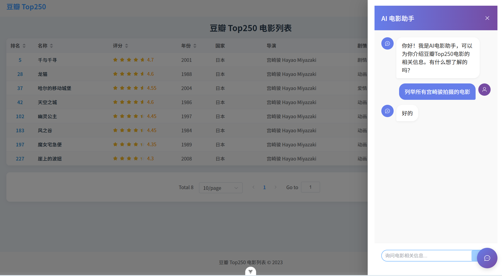

# 豆瓣电影 Top 250 可视化分析系统

## 项目介绍

这是一个基于 Vue 3 + FastAPI 开发的豆瓣电影 Top 250 可视化分析系统，旨在通过数据可视化和 AI 辅助查询，帮助用户更直观地了解豆瓣电影 Top 250 的数据特征和趋势。

### 核心功能

- **电影数据可视化**：通过多种图表展示电影评分、年份分布、类型分布等数据
- **AI 辅助查询**：使用大语言模型（LLM）生成 SQL 查询，支持自然语言提问
- **电影分类浏览**：按类型、国家、导演等维度浏览电影数据
- **响应式设计**：适配不同屏幕尺寸，提供良好的用户体验

## 🖼️ 运行效果

<div align="center">
  
  <p>图 1：Web 端电影数据可视化界面</p>
</div>

<div align="center">
  
  <p>图 2：AI 辅助查询界面</p>
</div>

## 技术栈

### 前端

- **框架**：Vue 3
- **路由**：Vue Router
- **UI 组件库**：Element Plus
- **构建工具**：Vite
- **开发语言**：JavaScript

### 后端

- **框架**：FastAPI
- **数据库**：MySQL（使用 pymysql 连接）
- **数据处理**：Pandas
- **AI 集成**：Ollama API（本地大语言模型）
- **开发语言**：Python 3.9+

## 项目结构

```
Vue_Fastapi豆瓣top250/
├── DouBan_Top205/         # 前端项目
│   ├── public/            # 静态资源
│   ├── src/               # 源代码
│   │   ├── components/    # 组件
│   │   ├── router/        # 路由配置
│   │   ├── stores/        # 状态管理
│   │   ├── views/         # 页面
│   │   ├── App.vue        # 根组件
│   │   └── main.js        # 入口文件
│   ├── package.json       # 前端依赖
│   └── vite.config.js     # Vite 配置
├── Fast_Api/              # 后端项目
│   ├── backend/           # 后端源代码
│   │   ├── api/           # API 路由
│   │   ├── data/          # 数据文件
│   │   ├── database/      # 数据库连接
│   │   ├── models/        # 数据模型
│   │   ├── services/      # 业务逻辑
│   │   ├── config.py      # 配置文件
│   │   └── main.py        # 后端入口
│   ├── .env               # 环境变量
│   ├── requirements.txt   # 后端依赖
│   └── start.txt          # 启动说明
└── .gitignore             # Git 忽略配置
```

## 环境要求

### 前端

- Node.js ^20.19.0 或 >=22.12.0
- npm 或 yarn 包管理器

### 后端

- Python 3.9+
- MySQL 数据库
- Ollama 服务（用于 AI 功能）

## 安装与运行

### 1. 克隆项目

```bash
git clone https://github.com/pwy114pwy/Vue_Fastapi_DoubanTop250
cd Vue_Fastapi豆瓣top250
```

### 2. 后端环境搭建

#### 2.1 创建并激活 conda 环境

```bash
# 创建 conda 环境
conda create -n douban-movies python=3.9

# 激活 conda 环境
conda activate douban-movies

# 进入后端目录
cd Fast_Api
```

#### 2.2 安装依赖

```bash
pip install -r requirements.txt
```

#### 2.3 配置环境变量

编辑 `.env` 文件，配置数据库连接信息：

```env
# .env
DB_HOST=localhost
DB_PORT=13306
DB_USER=root
DB_PASSWORD=abc123
DB_NAME=douban_movies
```

#### 2.4 启动后端服务

```bash
uvicorn backend.main:app --reload
```

后端服务默认运行在 `http://localhost:8000`

### 3. 前端环境搭建

#### 3.1 安装依赖

```bash
cd DouBan_Top205
npm install
```

#### 3.2 启动前端开发服务器

```bash
npm run dev
```

前端服务默认运行在 `http://localhost:5173`

### 4. 配置 Ollama 服务（可选，用于 AI 功能）

1. 下载并安装 [Ollama](https://ollama.com/download)
2. 拉取所需模型：
   ```bash
   ollama pull qwen3:8b
   ```
3. 启动 Ollama 服务

## 使用指南

### 1. 浏览电影数据

- **首页**：展示豆瓣电影 Top 250 的概览
- **分类浏览**：按类型、国家、导演等维度浏览电影
- **详情页**：查看电影的详细信息

### 2. 数据可视化分析

- **评分分析**：查看评分最高的电影
- **年份分析**：查看电影的年份分布
- **类型分析**：查看电影的类型分布
- **国家分析**：查看各国电影数量
- **导演分析**：查看导演的平均评分和作品数量

### 3. AI 辅助查询

在 AI 助手页面，您可以使用自然语言提问，系统会自动生成 SQL 查询并返回结果。例如：

- "评分最高的 10 部电影"
- "2010 年以后的科幻电影"
- "张艺谋导演的电影"

### 4. 常见问题

#### 4.1 后端服务启动失败

- 检查 MySQL 服务是否运行
- 检查 `.env` 文件中的数据库配置是否正确
- 检查 Ollama 服务是否运行（如果使用 AI 功能）
- 检查 conda 环境是否激活：`conda activate douban-movies`

#### 4.2 前端页面无法加载数据

- 检查后端服务是否正常运行
- 检查浏览器控制台是否有网络错误
- 检查前端 API 调用地址是否正确

#### 4.3 AI 功能无法使用

- 检查 Ollama 服务是否运行
- 检查模型是否正确拉取
- 检查 `llm_service.py` 中的 Ollama API 地址是否正确

## 数据说明

项目使用豆瓣电影 Top 250 的数据，包括以下字段：

- `title`：电影标题
- `rating`：评分
- `year`：上映年份
- `country`：国家/地区
- `director`：导演
- `genre`：类型
- `rank`：排名

## 开发与部署

### 前端构建

```bash
cd DouBan_Top205
npm run build
```

构建产物将生成在 `dist` 目录中。

### 后端部署

1. 使用 `uvicorn` 启动生产服务：
   ```bash
   uvicorn backend.main:app --host 0.0.0.0 --port 8000
   ```

2. 或使用 Gunicorn 作为生产服务器：
   ```bash
   gunicorn -w 4 -k uvicorn.workers.UvicornWorker backend.main:app
   ```

## 许可证

本项目采用 MIT 许可证。

## 贡献

欢迎提交 Issue 和 Pull Request，共同改进这个项目。

## 联系方式

如有问题或建议，欢迎联系项目维护者。
